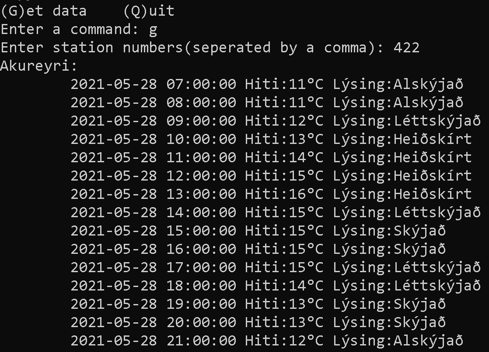

A simple Python application that fetches weather data from weather stations in Iceland and prints the corresponding info on the terminal.

Here is a list of weather stations in Iceland:
https://www.vedur.is/vedur/stodvar

**Screenshot:**
 

